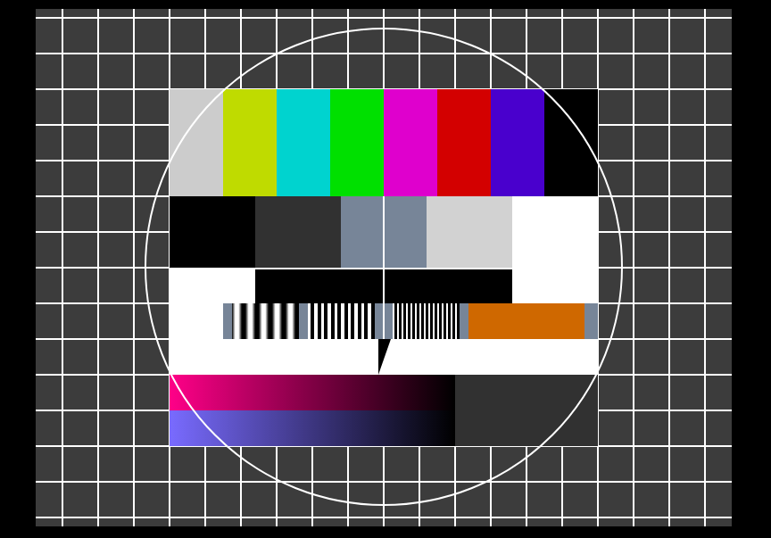

# TV-TestCard (FuBK-Testbild)

    

> A test card, also known as a test pattern or start-up/closedown test, is a television test signal, typically broadcast at times when the transmitter is active but no program is being broadcast (often at sign-on and sign-off). _(wikipedia)_

## Pure CSS Grid

---

[Peter R. Stuhlmann Webentwicklung](https://peter-stuhlmann-webentwicklung.de)
